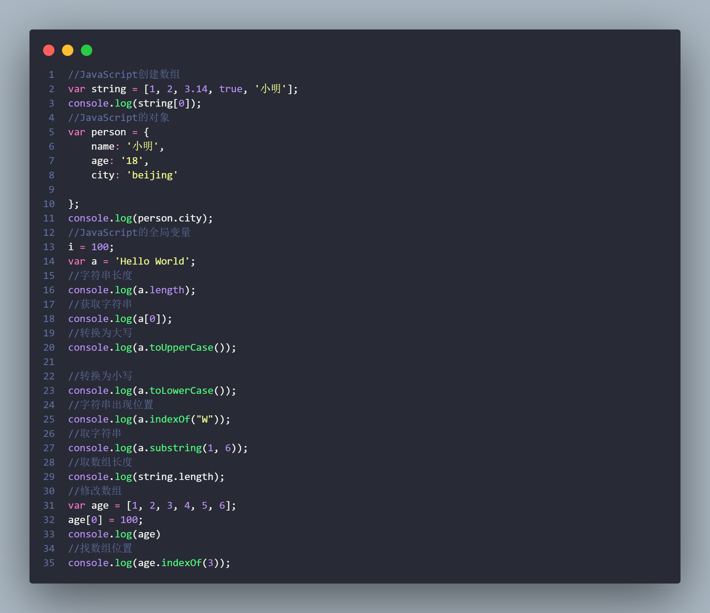
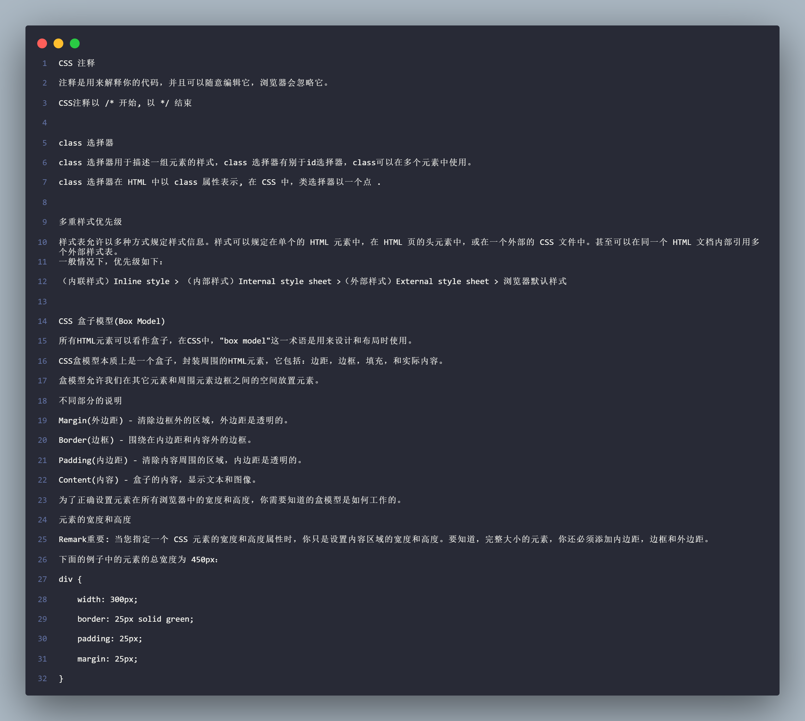

#文件夹解释：
>My

学习HTML和css以及JavaScript写的一款团队个人简历

>js

学习使用JavaScript代码仓库，index.js有JavaScript的全部代码，每一行都有代码解释

>html
>css

学习使用HTML和css的代码仓库，html/学习使用css.txt有css的部分代码，每一行都有代码解释可以直接引用

* * *
###欢迎点一个star
我们一起维护